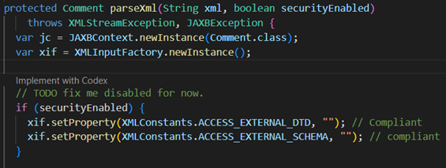
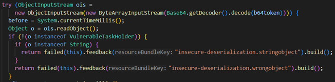
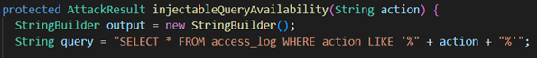
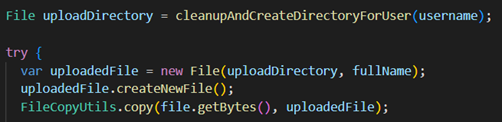
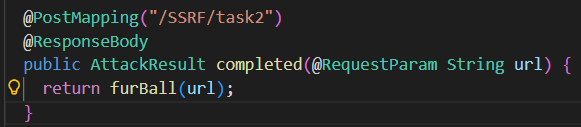

# Introduction

Code analysis tools have evolved over the years, especially with the recent advancements in the field of Artificial Intelligence (AI). The goal of this report is to provide a comparative security analysis between a traditional static analysis tool, Visual Code Grepper (VCG), and a more recent AI-assisted code analysis tool, Claude Code.

WebGoat, a deliberately insecure web application developed by OWASP, was selected for this test since it contains numerous security-focused lessons written in Java, a language supported by VCG and one that I am familiar with. Since the lessons are separated into folders categorized by vulnerability type, it is an ideal environment to test the results of the two tools against one another. The WebGoat repository is publicly available online.

# Methodology

Because of the size of the OWASP WebGoat repository, selected lesson folders were used to compare key vulnerability findings across tools in a manageable scope. The selected folders represent common vulnerability categories, including SQL injection, XML external entity (XXE), server-side request forgery (SSRF), JSON Web Token (JWT) weaknesses, insecure deserialization, and path traversal. Each folder was analyzed separately using both tools to allow for ease in comparison between the output from both tools.

For static code analysis, VCG was used to scan each directory individually. The resulting output was generated in XML format, then parsed and converted into a more readable form for inclusion in this repository with Claude Code. This step allowed for an easier comparison between the output of the VCG and Claude Code scans. However, Claude Code did add some interpretations of the original scans in the Markdown reports it generated, so original VCG scans were re-run and reviewed during the comparison phase to ensure the accuracy and prevent distortion of the underlying results.

For the AI-assisted analysis, the Claude Code security-review command found in this repository was modified and run on the selected folders. Two Markdown reports were generated, with each containing the scan output from three of the six target folders. The core behavior of the security-review command was maintained. The modifications were limited to enabling full local repository scanning and producing Markdown-formatted output.

After generating output from both scans, manual validation of the findings was performed. One high-severity finding from each folder was selected for in-depth comparison. The analysis focused on distinguishing true positives from false positives and assessing the overall accuracy of each tool. In addition, the practical usability and workflow efficiency of both scanning approaches were evaluated.

# Findings & Comparison

## XXE Injection [1]

### 1. VCG Output ([Report](vcg-report-xxe.md))

VCG reported several lower-severity findings, but it did not identify the insecure XML parsing configuration in `CommentsCache.java:68` or the three injection points in `SimpleXXE.java:54`, `BlindSendFileAssignment.java:79`, or `ContentTypeAssignment.java:60`.

### 2. Claude Code Output ([Report](claude-report-1.md))

Claude Code successfully identified the XXE vulnerability in `CommentsCache.java:68`. It also flagged the three injection points in `SimpleXXE.java:54`, `BlindSendFileAssignment.java:79`, and `ContentTypeAssignment.java:60`.

### 3. Validation

This was a valid XXE vulnerability. As shown in Fig. 1, the XML parsing method includes a Boolean parameter that conditionally enables security features to restrict external entity resolution, rather than enforcing these protections by default.

*Fig. 1: XML parsing method with conditional security controls*

The comments-processing functionality uses this method to handle XML input. However, every place where this method is called passes `false` for the `securityEnabled` parameter. This means the XML parser runs without protections against external entity resolution. Because the application is parsing user-controlled XML in this insecure state, an attacker can send a malicious XML payload that includes external entities. When the server processes it, those entities can be resolved, which could allow access to local files or trigger requests from the server.

### 4. Comparison Analysis

For this vulnerability, Claude Code was clearly more accurate than VCG. Claude Code identified both the insecure design of the `parseXml` method and the three locations where it is used with security turned off. It was able to connect how the method is written with how it is actually used in the application.

VCG, on the other hand, reported several lower-severity issues but completely missed the main high-severity vulnerability. This shows that it struggled to recognize how the insecure configuration becomes exploitable in practice.

A simple fix for this would be to enable the XML security features by default inside the `parseXml` method. The option to disable them should either be removed or handled in a way that cannot be misused. This would prevent the parser from processing external entities and eliminate the XXE risk.

## Insecure Deserialization [2]

### 1. VCG Output ([Report](vcg-report-deserialization.md))

VCG reported several findings related to the use of `ObjectInputStream`, flagging it as a potential entry point for unsafe data. However, it only classified these as standard or low-severity issues and did not identify the actual remote code execution risk in `InsecureDeserializationTask.java:45`.

### 2. Claude Code Output ([Report](claude-report-1.md))

Claude Code successfully identified a high-severity insecure deserialization vulnerability in `InsecureDeserializationTask.java:45`. It correctly recognized that user-controlled input is passed directly into `ObjectInputStream.readObject()` without any filtering or validation, leading to a potential remote code execution scenario.

### 3. Validation (Ground Truth)

This was a valid insecure deserialization vulnerability. The application accepts a base64-encoded object from user input, decodes it, and passes it directly into `ObjectInputStream.readObject()` as seen in Fig. 2.

*Fig. 2: Insecure deserialization using ObjectInputStream*

The issue is that `readObject()` is called before any type checking is performed. Even though the code later checks whether the object is an instance of `VulnerableTaskHolder`, that check happens after deserialization has already occurred. Because of this, an attacker can send a malicious serialized object containing a gadget chain. When the server processes it, the code inside that object can execute immediately during deserialization, before the application has a chance to validate it.

### 4. Comparison Analysis

For this vulnerability, Claude Code was again more accurate than VCG. Claude Code identified the exact point where unsafe deserialization occurs and correctly classified it as a high-severity issue with a clear exploitation path.

VCG, on the other hand, only flagged the use of `ObjectInputStream` as a general concern and did not recognize how it could be exploited in this specific context. This shows that it can identify risky APIs but struggles to determine when they actually lead to a real vulnerability.

A simple fix for this would be to avoid using `ObjectInputStream` on untrusted data entirely. If deserialization is required, strict filtering [3] or allowlisting should be applied to limit which classes can be deserialized. This would prevent malicious objects from being processed and eliminate the risk of code execution.

## SQL Injection [4]

### 1. VCG Output ([Report](vcg-report-sql.md))

VCG reported a large number of findings across the SQL injection lessons, including one critical SQL injection in `SqlInjectionLesson10.java:56`. However, most of its findings were classified as low or potential issues, and it did not clearly identify the broader pattern of unsafe query construction across multiple files.

### 2. Claude Code Output ([Report](claude-report-1.md))

Claude Code identified multiple high-severity SQL injection vulnerabilities across several files, including `SqlInjectionLesson2.java:49`, `SqlInjectionLesson5a.java:48`, and `SqlInjectionLesson8.java:50`. It consistently flagged cases where user input is directly concatenated into SQL queries without proper parameterization.

### 3. Validation (Ground Truth)

This was a valid SQL injection vulnerability. Across multiple endpoints, the application builds SQL queries by directly concatenating user input into the query string instead of using parameterized statements like the example in Fig. 3.

*Fig. 3: SQL query built using string concatenation*

The issue is that user-controlled input is inserted directly into SQL queries without any validation or parameterization. This allows an attacker to modify the structure of the query itself. Because of this, an attacker can inject SQL code into the input fields. Depending on the endpoint, this could allow them to bypass authentication checks, retrieve sensitive data, or modify database contents.

### 4. Comparison Analysis

For this vulnerability, Claude Code again provided more accurate and consistent results than VCG. Claude Code identified multiple instances of SQL injection and clearly recognized the pattern of unsafe query construction across the application.

VCG did identify at least one SQL injection issue, but most of its output was either lower-severity findings or loosely related issues. It did not clearly connect the repeated use of string concatenation with the overall risk of SQL injection.

A simple fix for this would be to replace all dynamically built SQL queries with parameterized `PreparedStatement` queries [5]. This ensures that user input is treated as data rather than executable SQL, preventing injection attacks.

## Path Traversal [6]

### 1. VCG Output ([Report](vcg-report-pathtraversal.md))

VCG reported several findings related to file handling and input entry points, but none of them were identified as path traversal vulnerabilities. Most findings were classified as standard or potential issues, focusing on general file usage rather than actual exploitability.

### 2. Claude Code Output ([Report](claude-report-2.md))

Claude Code identified multiple high-severity path traversal vulnerabilities, including issues in `ProfileUploadBase.java:51`, `ProfileUploadFix.java:43`, and `ProfileZipSlip.java:79`. It correctly flagged cases where user-controlled input is used to construct file paths without proper validation.

### 3. Validation (Ground Truth)

This was a valid path traversal vulnerability. The application uses user-controlled input, such as file names, to construct file paths without properly validating whether those paths stay within the intended directory.

*Fig. 4: File path constructed from username without validation*

The issue is that user input is directly used when creating file paths. In some cases, the application even writes the file to disk before checking whether the path is safe. Although canonical path checks are present, they are performed after the file operation has already occurred, making them ineffective [7]. Because of this, an attacker can include path traversal sequences like `../` in the input to escape the intended directory. This allows them to write or access files in unintended locations on the server.

### 4. Comparison Analysis

For this vulnerability, Claude Code was significantly more effective than VCG. Claude Code identified multiple instances of path traversal and recognized how user input directly impacts file system operations.

VCG, on the other hand, only flagged general file-handling patterns and did not identify any of the actual path traversal risks. This shows that it can detect potentially sensitive APIs but struggles to determine when they are used in an unsafe way.

A simple fix for this would be to validate and normalize all file paths before using them [7]. The application should ensure that any resolved path stays within the intended directory and reject any input that attempts to escape it. This would prevent unauthorized file access and eliminate the path traversal risk.

## Server-Side Request Forgery (SSRF) [8]

### 1. VCG Output ([Report](vcg-report-ssrf.md))

VCG did not identify any SSRF vulnerabilities in the scanned code. Its findings were limited to general recommendations, such as classes not being declared as final, which are unrelated to SSRF risk.

### 2. Claude Code Output ([Report](claude-report-2.md))

Claude Code identified a potential SSRF vulnerability in `SSRFTask2.java:36`. It correctly flagged that user-controlled input is used to construct a URL that the server then requests, which can lead to unintended outbound network access.

### 3. Validation (Ground Truth)

This was a valid SSRF vulnerability. The application accepts a URL as input and uses it to make an outbound request from the server.

*Fig. 5: Server making request based on user-controlled URL*

The issue is that user input is used to determine where the server sends an HTTP request. Even though the application attempts to restrict the allowed URL, the design still relies on user-controlled input to drive server-side network activity. Because of this, an attacker could potentially manipulate the request to access unintended resources or expose information about the server. In this case, the response includes data returned from the external request, which could reveal details such as the server's IP address.

### 4. Comparison Analysis

For this vulnerability, Claude Code was significantly more effective than VCG. Claude Code identified the core issue of user-controlled URLs being used in server-side requests and correctly flagged it as a potential security risk.

VCG, on the other hand, failed to identify any SSRF-related issues and only reported unrelated low-value findings. This shows that it struggles to detect vulnerabilities that depend on understanding how data flows through the application.

A simple fix for this would be to avoid making outbound requests based on user input. If this behavior is required, the application should strictly validate the URL against a trusted allowlist and prevent access to internal or unexpected resources [8]. This would significantly reduce the SSRF risk.

# Conclusion

Overall, the comparison shows a clear difference between traditional static analysis and AI-assisted code review. Claude Code was consistently more effective at identifying high-severity vulnerabilities and understanding how they could actually be exploited in the context of the application. VCG was able to flag risky APIs and general patterns, but it often failed to recognize when those patterns led to real vulnerabilities.

One factor that may have influenced these results is the structure of the WebGoat repository itself. The lesson folders are labeled by vulnerability type, and many of the classes and methods include descriptive names and comments that hint at their purpose. This likely provided additional context that made it easier for Claude Code to identify the vulnerabilities. It would be interesting to evaluate how Claude performs on code that does not include these kinds of contextual clues, where the intent of the code is less obvious.

In practice, both approaches still have value. Static analysis tools can quickly scan large codebases and identify potential risk areas, while AI-assisted tools can provide deeper insight into how those risks become exploitable. Using both together would likely provide the most complete coverage.

# References

[1] OWASP, "XML External Entity (XXE)," OWASP. [Online]. Available: https://owasp.org/www-community/vulnerabilities/XML_External_Entity_(XXE)_Processing. [Accessed: Apr. 2, 2026].

[2] OWASP, "Insecure Deserialization," OWASP Top 10 (2017). [Online]. Available: https://owasp.org/www-project-top-ten/2017/A8_2017-Insecure_Deserialization. [Accessed: Apr. 2, 2026].

[3] Oracle, "ObjectInputFilter (Java SE 11 & JDK 11)," Oracle Java Platform Documentation. [Online]. Available: https://docs.oracle.com/en/java/javase/11/docs/api/java.base/java/io/ObjectInputFilter.html. [Accessed: Apr. 2, 2026].

[4] OWASP, "SQL Injection," OWASP. [Online]. Available: https://owasp.org/www-community/attacks/SQL_Injection. [Accessed: Apr. 2, 2026].

[5] Oracle, Using Prepared Statements. Oracle Java Tutorials. [Online]. Available: https://docs.oracle.com/javase/tutorial/jdbc/basics/prepared.html. [Accessed: Apr. 2, 2026].

[6] OWASP, "Path Traversal," OWASP. [Online]. Available: https://owasp.org/www-community/attacks/Path_Traversal. [Accessed: Apr. 2, 2026].

[7] Oracle, "File (Java Platform SE 8) - getCanonicalPath()," Oracle Documentation. [Online]. Available: https://docs.oracle.com/javase/8/docs/api/java/io/File.html#getCanonicalPath--. [Accessed: Apr. 2, 2026].

[8] OWASP, "Server-Side Request Forgery (SSRF)," OWASP. [Online]. Available: https://owasp.org/www-community/attacks/Server_Side_Request_Forgery. [Accessed: Apr. 2, 2026].
